## EXNO-3-DS

# AIM:
To read the given data and perform Feature Encoding and Transformation process and save the data to a file.

# ALGORITHM:
STEP 1:Read the given Data.
STEP 2:Clean the Data Set using Data Cleaning Process.
STEP 3:Apply Feature Encoding for the feature in the data set.
STEP 4:Apply Feature Transformation for the feature in the data set.
STEP 5:Save the data to the file.

# FEATURE ENCODING:
1. Ordinal Encoding
An ordinal encoding involves mapping each unique label to an integer value. This type of encoding is really only appropriate if there is a known relationship between the categories. This relationship does exist for some of the variables in our dataset, and ideally, this should be harnessed when preparing the data.
2. Label Encoding
Label encoding is a simple and straight forward approach. This converts each value in a categorical column into a numerical value. Each value in a categorical column is called Label.
3. Binary Encoding
Binary encoding converts a category into binary digits. Each binary digit creates one feature column. If there are n unique categories, then binary encoding results in the only log(base 2)ⁿ features.
4. One Hot Encoding
We use this categorical data encoding technique when the features are nominal(do not have any order). In one hot encoding, for each level of a categorical feature, we create a new variable. Each category is mapped with a binary variable containing either 0 or 1. Here, 0 represents the absence, and 1 represents the presence of that category.

# Methods Used for Data Transformation:
  # 1. FUNCTION TRANSFORMATION
• Log Transformation
• Reciprocal Transformation
• Square Root Transformation
• Square Transformation
  # 2. POWER TRANSFORMATION
• Boxcox method
• Yeojohnson method

# CODING AND OUTPUT:
```
import pandas as pd 
df=pd.read_csv("Encoding Data.csv") 
df
```

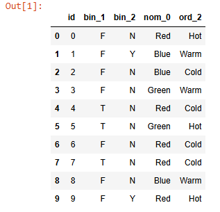

```
# ORDINAL ENCODING 
from sklearn.preprocessing import LabelEncoder,OrdinalEncoder 
pm=['Hot','Warm','Cold'] 
e1=OrdinalEncoder(categories=[pm]) 
e1.fit_transform(df[["ord_2"]])
```

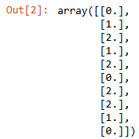

```
df['bo2']=e1.fit_transform(df[["ord_2"]]) 
df
```

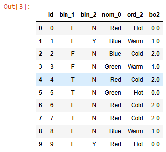

```
# Label Encoder ( orders in alphabetical order) 
le=LabelEncoder() 
dfc=df.copy() 
dfc['ord_2']=le.fit_transform(dfc['ord_2']) 
dfc
```

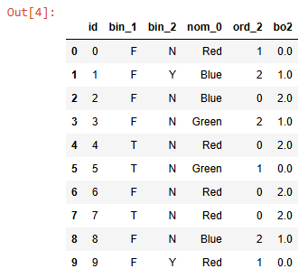

```
# ONE HOT ENCODING 
from sklearn.preprocessing import OneHotEncoder 
ohe=OneHotEncoder(sparse_output=False) 
df2=df.copy() 
enc=pd.DataFrame(ohe.fit_transform(df2[["nom_0"]])) # Orders in Alphabetical Order Blue , Green, Red 
df2=pd.concat([df2,enc],axis=1) 
df2
```

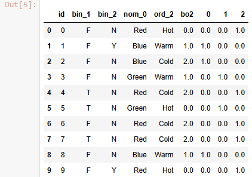

```
pd.get_dummies(df2,columns=["nom_0"])
```

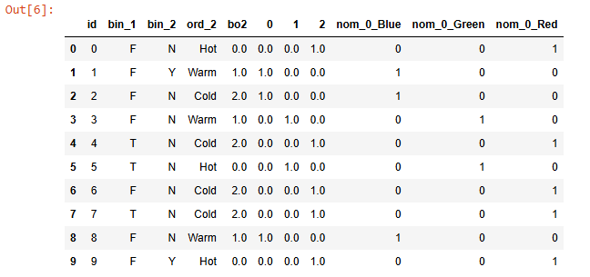

```
pip install --upgrade category_encoders
```

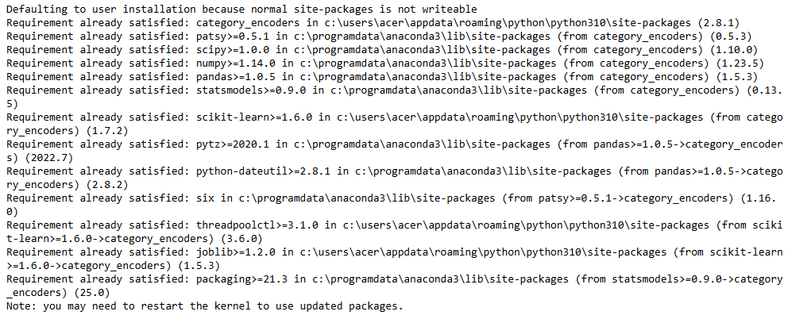

```
# BINARY ENCODER 
from category_encoders import BinaryEncoder 
df=pd.read_csv("data.csv") 
df
```

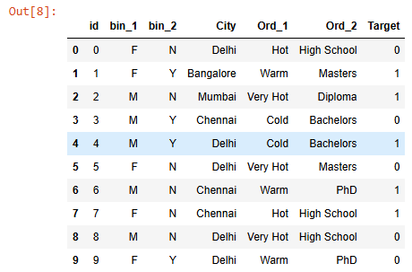

```
be=BinaryEncoder() 
nd=be.fit_transform(df['Ord_2']) 
dfb=pd.concat([df,nd],axis=1) 
dfb
```

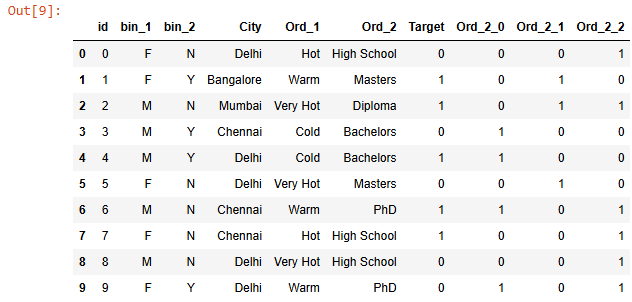

```
# MEAN ENCODING 
from category_encoders import TargetEncoder 
te=TargetEncoder() 
CC=df.copy() 
new=te.fit_transform(X=CC["City"],y=CC["Target"]) 
CC=pd.concat([CC,new],axis=1) 
CC
```

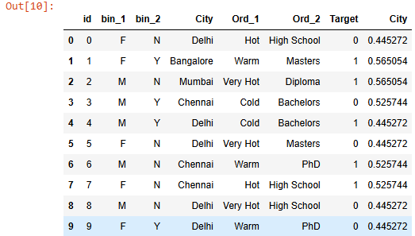

```
# FEATURE TRANSFORMATION 
import pandas as pd 
from scipy import stats 
import numpy as np 
df=pd.read_csv("Data_to_Transform.csv") 
df
```

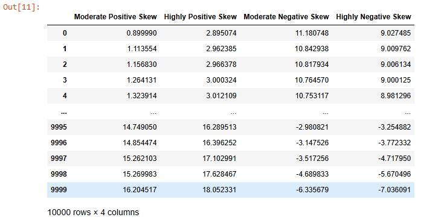

```
df.skew()
```

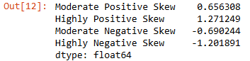

```
# 1. LOG TRANSFORMATION 
np.log(df["Highly Positive Skew"])
```

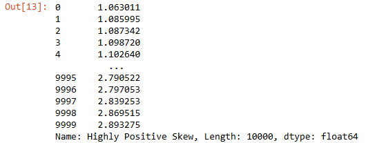

```
# 2. RECIPROCAL TRANSFORMATION 
np.reciprocal(df["Moderate Positive Skew"])
```

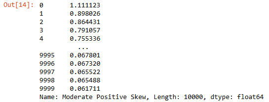

```
# 4. SQUARE ROOT TRANSFORMATION 
np.sqrt(df["Highly Positive Skew"])
```

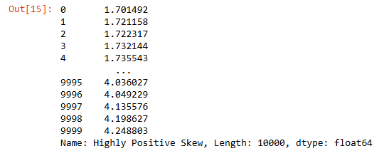

```
# 5. SQUARE TRANSFORMATION 
np.square(df["Highly Positive Skew"])
```

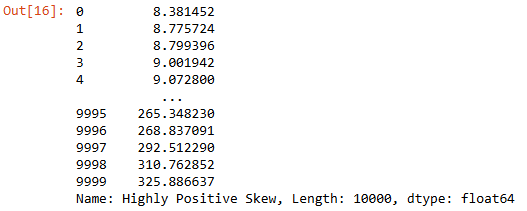

```
# POWER TRANSFORMATIONS 
#        BOX COX 
df["Highly Positive Skew_boxcox"], parameters=stats.boxcox(df["Highly Positive Skew"]) 
df
```

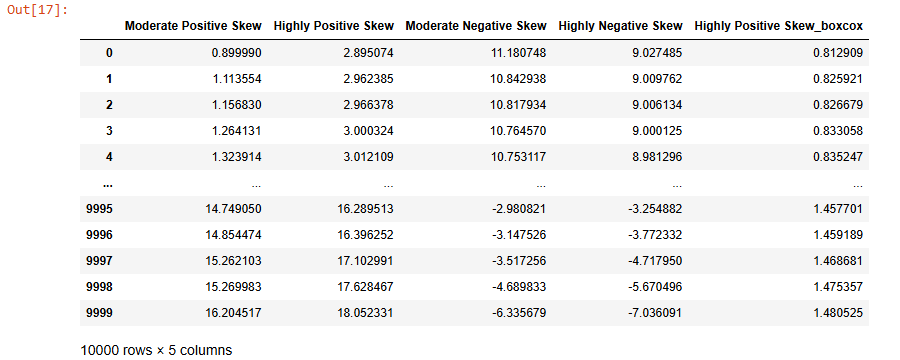

```
df.skew()
```

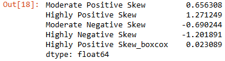

```
# YEO_JOHNSON 
df["Highly Negative Skew_yeojohnson"],parameters=stats.yeojohnson(df["Highly Negative Skew"]) 
df.skew()
```

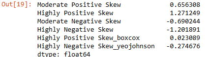

```
# QUANTILE TRANSFORMATION 
from sklearn.preprocessing import QuantileTransformer 
qt=QuantileTransformer(output_distribution='normal') 
df["Moderate Negative Skew_1"]=qt.fit_transform(df[["Moderate Negative Skew"]]) 
df
```

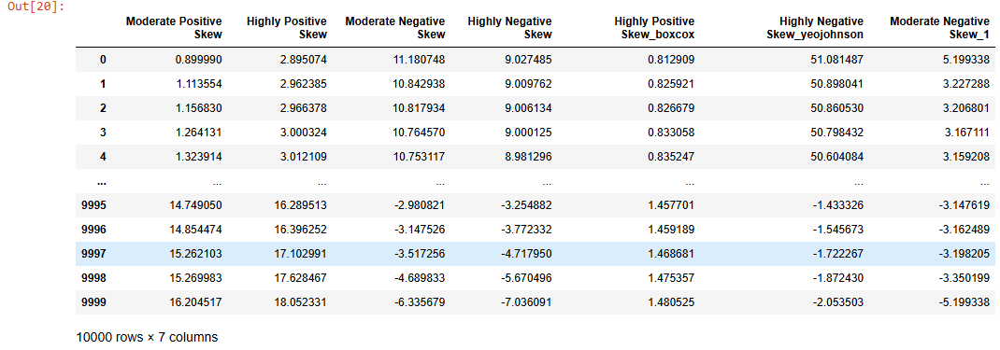

```
import seaborn as sns 
import statsmodels.api as sm 
# STATS MODEL- STATISTICAL MODEL TO VISUALIZE DISTRIBUTION 
import matplotlib.pyplot as plt 
sm.qqplot(df["Moderate Negative Skew"],line='45') # QQ - QUANTILE QUANTILE PLOT plt.show()
```

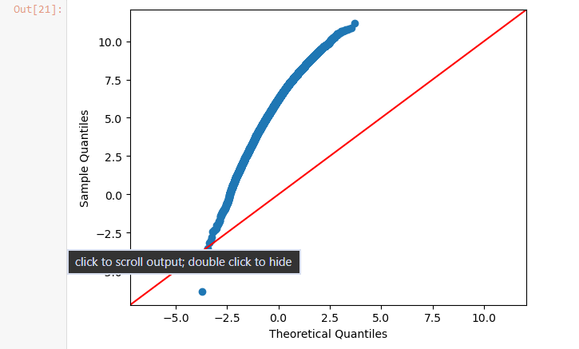

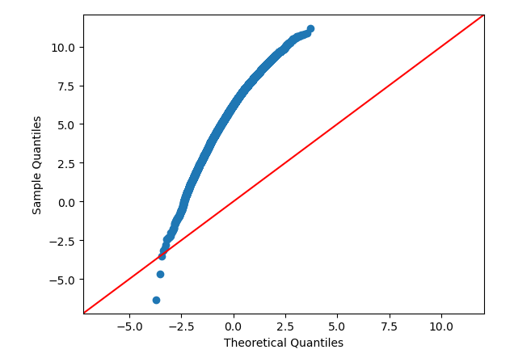

```
from sklearn.preprocessing import QuantileTransformer
qt = QuantileTransformer(output_distribution='normal', n_quantiles=891)
df["Moderate Negative Skew"]=qt.fit_transform(df[["Moderate Negative Skew"]])
sm.qqplot(df["Moderate Negative Skew"], line='45')
plt.show()
```
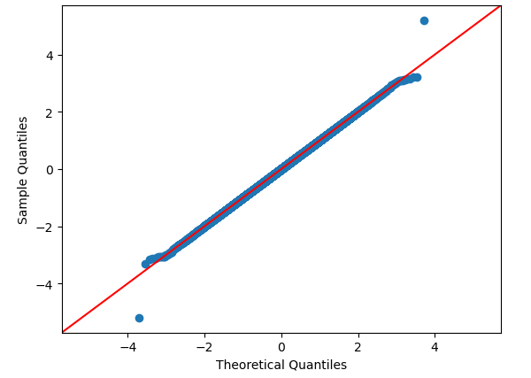
# RESULT:
The dataset was successfully cleaned, encoded, transformed, and saved as a preprocessed dataset. This makes the data suitable for further machine learning and data analysis tasks.

       
